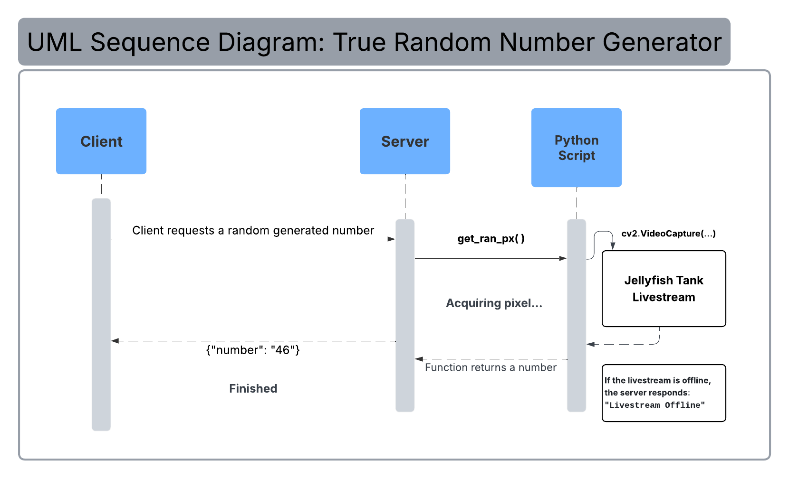

# Communication Contract
## True Random Number Generator Service
This algorithm picks a random pixel from a jellyfish tank livestream on YouTube and then chooses one of its three
color values (RGB) to generate a random number.

#### Install Node Packages
Install `node.js` dependencies in the project directory.

    - npm install

## Requesting Data
Clients can request a random generated number by sending an HTTP GET requests to the server on `port 3002`

    - http://localhost:3002/

### Run Server
Start the server with the following command:

    - npm start

### Example Request:
**While running the server...**

Use cURL to make a request directly in the terminal:

    curl http://localhost:3002/

Expected response (the number will be random):

    {"number":"13"}

## Recieving Data
Upon running, The server executes a Python script (random_number_generator.py):

1. Extracts a still frame from a jellyfish tank livestream.
2. Picks a random pixel.
3. Selects a random RGB value from the chosen pixel.
4. Returns it as an integer in JSON format.

### Example Recieve:

###### On a web browser, go to: http://localhost:3002/:

     {"number":"46"}
     
###### On the terminal, stdout will show the server output when running:
      == Server is listening on port 3002
      Acquiring pixel...
      46
      Finished

### Error:
If the livestream is offline, the server will respond to the client with: `"Livestream Offline"`.

## UML Sequence Diagram

